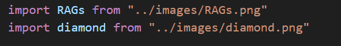

# Portfolio Website

This is my personal website showcasing my work as a data professional. This portfolio is mainly built using **React** and **MUI**.

---

## Getting Started

### 1. Fork the Project  

```bash
git clone https://github.com/deepak-dulal/Portfolio-Website/fork
```
### 2. Clone Your Fork

```bash
git clone https://github.com/YOUR-USERNAME/Portfolio-Website
```

### 3. Install the npm Packages

```bash
npm install
```

### 4. Start the Project

```bash
npm start
```

### 5. Change the Resume Link URL

Edit the following file:

```
src/assets/configs/menuConfig.js
```

Replace the resume link with your own.

### 6. Build the Website

```bash
npm run build
```

### 7. Run Locally (Production Build)

```bash
serve -s build
```

---

## 🔧 Customize Based on Your Need

All the configuration you need to make is in the `assets` folder. It includes two folders:

### 1. `configs/`

For each main component, there is one configuration file. For example:
- Menu → `menuConfig.js`
- Footer → `footerConfig.js`

You can change these based on your need.

### 2. `images/` Folder

You can put all your images here and import them like shown in the first few lines of each config file.


---

## Google Analytics (Optional)

If you want to use Google Analytics to track traffic:

1. Open `.env.example`
2. Add your Google Tracking ID to:

```
REACT_APP_TRACKING_ID=your_tracking_id
```

3. Rename the file to `.env`

---

## 📝 License

This project is licensed under the [MIT License](LICENSE).

You are free to use, modify, and distribute this project with attribution. See the `LICENSE` file for full details.